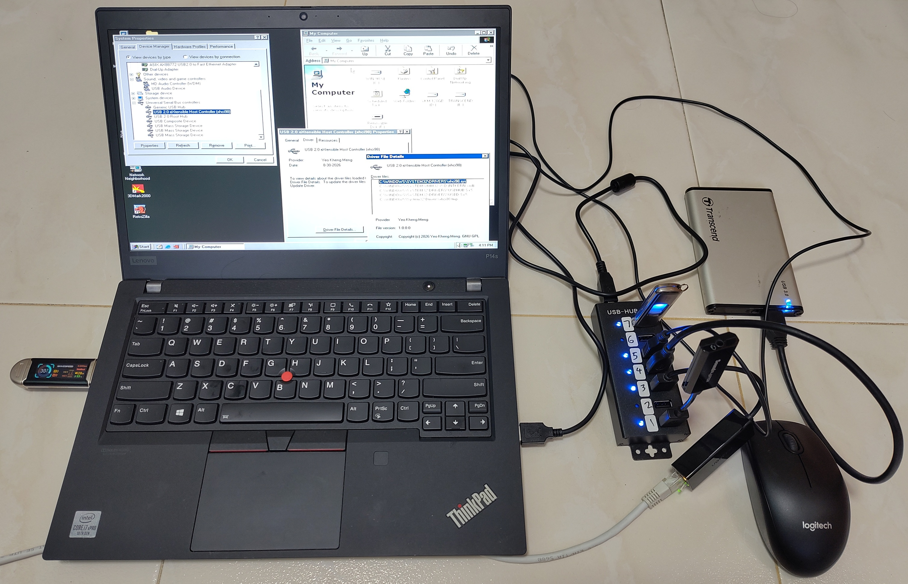
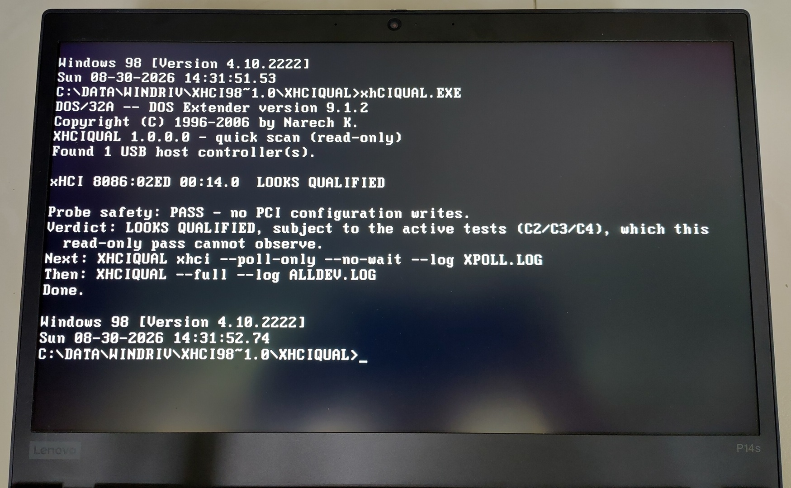
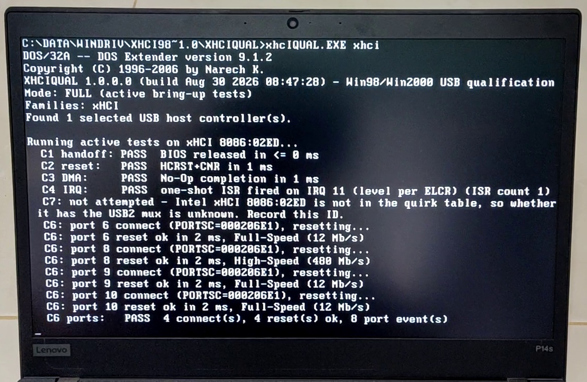
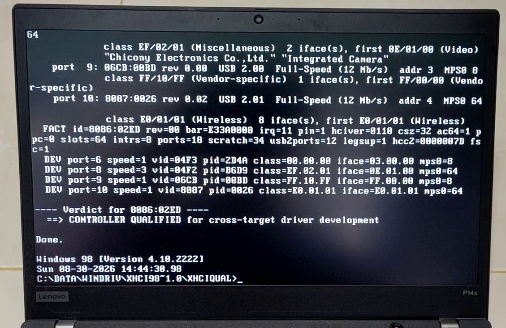
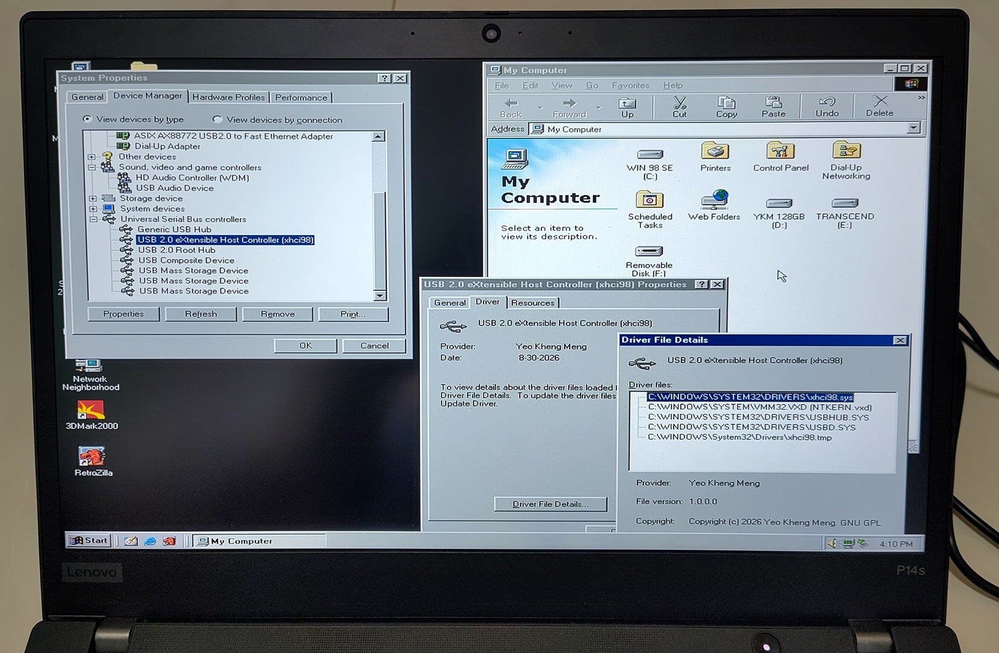
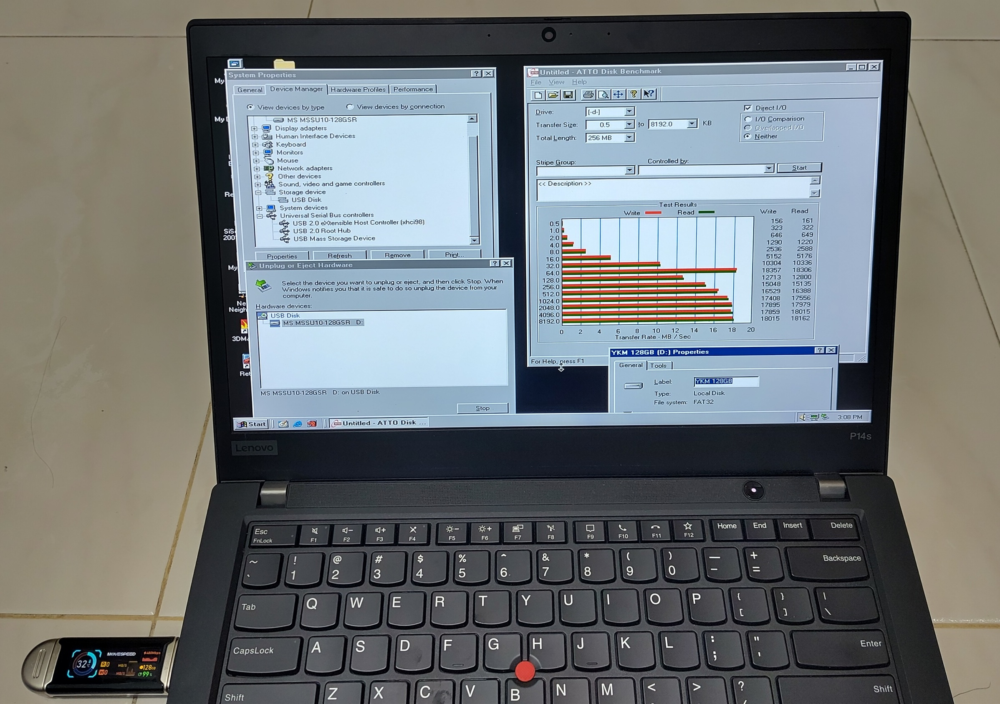

# xhci98

This project xHCI98 is a WDM generic USB host controller driver for xHCI host controllers targeting Windows 98 SE, ME, 2000 SP4 and 32-bit XP. Although xHCI Controllers offer USB 3.0, this driver runs USB 2.0 on the controller only.

This driver is developed based on Intel's xHCI specification and tested only on Intel machines so far. No guarantees have been made on xHCI implementations from other vendors.

This project is from a solo human with AI-assistance only so bugs are not unexpected. Feel free to report them if you encounter any issues.



This is my 2020 ThinkPad P14s Gen 1 (Comet Lake xHCI, no EHCI) on Windows 98 SE. Connected devices are 7-port hub, USB Ethernet, USB Audio, a USB-to-SATA bridge, two flash drives and a mouse all using the xHCI controller.

Demo video: https://www.youtube.com/watch?v=AU77f9CSbYc

Blog post of this project: https://yeokhengmeng.com/2026/08/xhci98-usb-host-driver/

## Motivation

Modern PCs from the mid-2010s onwards use xHCI-only USB chipsets. Windows 98 shipped with UHCI/OHCI drivers (USB 1.1) and gained EHCI (USB 2.0) through the back-ported stack in NUSB. Windows 2000 gained EHCI natively in SP4.

Neither has native xHCI support at all so even basic devices like keyboards, mice and flash drives do not work out of the box without BIOS support. Even with BIOS support, those devices cannot be hotplugged and other devices like Ethernet and Audio are not supported. 

This project attempts to fill that gap.

## Why USB 2.0 only, on a USB 3.0 controller

The existing `usbport.sys` this driver depends on does not support USB 3.0 and neither does anything above it. This project driver `xhci98.sys` is only the miniport underneath that stack.

SuperSpeed would mean rewriting the entire USB HCD (Host Controller Driver) for both operating systems. This is significantly more work than this driver for a speed that most machines running Windows 98 or Windows 2000 is unlikely to effectively use. The [xHCI programming guide](docs/usb-xhci-info/xhci-programming.md#what-superspeed-support-would-require) summarises what it would take.

Every USB 3.x connector (USB4/Thunderbolt included) also carries the USB 2.0 wires and xHCI exposes them as a separate logical port per connector. This driver manages those USB 2.0 ports and leaves the USB 3.x ones unpowered so a SuperSpeed-capable device falls back on the USB 2.0 port and runs at High-Speed.

## Installation Steps

The driver needs a USB 2.0 stack (`usbport.sys` + `usbhub20.sys`) on the machine first:

- **Windows 98 SE**: either install [NUSB 3.3 or 3.6](https://www.philscomputerlab.com/windows-98-usb-storage-driver.html) or the newer [SweetLow stack](http://sweetlow.orgfree.com/download/usb20_win9x.zip). For SweetLow's stack, unzip, right-click the `USB2.INF` at its root, install, reboot.
- **Windows ME**: the [SweetLow stack](http://sweetlow.orgfree.com/download/usb20_win9x.zip) only.
- **Windows 2000 SP4 and XP SP3 (32-bit)**: nothing to install; SP4 has the stack (or use the standalone USB 2.0 update KB319973).

On an xHCI-only Windows 98 SE or ME machine, **have the Windows installation CD at hand** or the contents on disk as the driver needs some files from there.

Optional but recommended: boot real DOS (not a DOS box inside Windows) and run `XHCIQUAL` from the `XHCIQUAL\` folder. A controller reporting no legacy interrupt pin cannot be driven on either system and there is no software workaround, so find out before you install anything.



Basic read-only quick scan answers in one line. The `xhci` run below it exercises the controller (handoff, reset, DMA, interrupt, port resets) and ends with a verdict:



Running the full check.



Controller qualified verdict.

XHCIQUAL demo video: https://www.youtube.com/watch?v=Tv6blmBS6Do

### Install

1. Put the unzipped package somewhere the machine can read: a floppy, a CD, a shared folder. `release\` is the one to install. `debug\` is the same driver built for troubleshooting, only install if asked.
2. In Device Manager, find the unrecognised xHCI controller. It sits unclaimed with a yellow mark, usually under "Other devices" such as "Universal Serial Bus Controller".
3. Properties -> Driver -> Update Driver -> Specify a location/Have Disk -> the `release\` directory.
4. It installs as "USB 2.0 eXtensible Host Controller (xhci98)" with a "USB Root Hub" underneath it, and neither should carry a warning mark.



**On Windows 98 with NUSB, do not disable, remove or upgrade this driver in Device Manager**. Each of those blue-screens that system. The fault is in NUSB's `usbport.sys`, the Windows 2000 build of the USB 2.0 stack, not this driver. Microsoft's own USB drivers do the same thing on the same machine. The readme has the way round it for NUSB systems.

The same driver on the same machine survives all three under SweetLow's build of that stack.

## What is tested, and what is not

Windows 98 SE is validated on real hardware. Windows 2000 SP4, Windows ME and Windows XP have only ever run in QEMU virtual machines.

| Machine | Controller |
|---|---|
| ThinkPad E460 (2016) | Intel Skylake, Sunrise Point-LP (100-series) PCH. xHCI 1.0, `8086:9D2F`, 18 ports (12 USB 2.0 managed, 6 USB 3.0 left unpowered), no EHCI. |
| ThinkPad P14s Gen 1 (2020) | Intel Comet Lake PCH-LP (400-series). xHCI 1.1, `8086:02ED`, 18 ports (12 USB 2.0 managed, 6 USB 3.1 left unpowered), no EHCI. |

| | State |
|---|---|
| Windows 98 SE | Validated on real hardware and in VMs. HID, mass storage, USB Ethernet and USB Audio have all run on real xHCI silicon, at a root port and behind hubs. |
| Windows 2000 SP4 | Virtual machines only, including an SMP guest and Driver Verifier. It has never run on real hardware. |
| Windows ME | One virtual machine only, under SweetLow's USB 2.0 stack (the only stack it is supported with): the driver loads and starts, and a HID mouse, a USB mass-storage device and a composite audio device bind (2026-09-02). Never run on real hardware. |
| 32-bit Windows XP | One virtual machine only (XP Professional SP3): the package installs on an xHCI-only machine with no prompt, the driver loads and starts under XP's own USB stack, and a HID mouse, a USB mass-storage device and a composite audio device bind; disable, enable, remove and rescan in Device Manager all survive. Never run on real hardware. |
| Intel 7/8-series (`XUSB2PR` mux), AMD | Never run on either. Everything said about the `XUSB2PR` port mux comes from Intel's datasheet and Linux, not silicon. The driver does not touch it. |
| Resume from standby (Windows 2000) | Never executed anywhere. No available VM offers a resumable power transition, and there is no Windows 2000 machine. |
| Low Speed, USB Audio, hub topologies | Work on Windows 98 hardware in the configurations tried. Not covered: an audio device with `bInterval > 1`, a USB 1.1 hub under a multi-TT hub, and the Windows 2000 side on silicon. |

The devices checked so far, all on the E460 under Windows 98 SE. Each is characterised in [test-equipment.md](docs/contributing/test-equipment.md).

| Device | VID:PID | Speed | Result |
|---|---|---|---|
| Terminus 7-port hub, multi-TT | `1A40:0201` | High | The hub every "behind a hub" result below was taken on. |
| Terminus 4-port hub, single-TT | `1A40:0101` | High | Characterised. The swap partner for the hub above. |
| Genesys 7-port hub (two cascaded chips), single-TT | `05E3:0608` | High | Characterised. A second-tier hub position. |
| Logitech USB Optical Mouse | `046D:C077` | Low | Works at a root port and behind the multi-TT hub. |
| Microsoft Wired Keyboard 600 (composite, two HID interfaces) | `045E:0750` | Low | Types, once Windows 98's own `usbhub.sys` is present; since 1.0.0.1 the install has Windows copy it from the Windows 98 CD or CABs. |
| SanDisk U3 Titanium flash drive | `0781:5408` | High | Works at a root port and behind the hub. |
| MSSU10-128GSR and SanDisk 3.2Gen1 USB 3.0 flash drives | `090C:2320`, `0781:55AB` | High (SuperSpeed falls back) | Enumerate at High-Speed on the USB 2.0 port. A file round trip passed. |
| StoreJet Transcend USB-to-SATA bridge (ASMedia) | `174C:5106` | High (SuperSpeed falls back) | A drive letter, and a file written and read back with matching contents. The first real bridge chip this driver has done verified I/O through. |
| ASIX AX88772A USB Ethernet | `0B95:7720` | High | DHCP lease and traffic on Windows 98 hardware. Also validated on Windows 2000 in a VM. Wedges the machine in three fast replug cycles (the defect below). |
| Sound Blaster Play! 2 (UAC 1.0 composite) | `041E:323D` | Full | Plays clean at a root port and behind the multi-TT hub. |
| Sound Blaster Play! 3, C-Media USB Audio Device (UAC 1.0) | `041E:324D`, `0D8C:0014` | Full | Enumerate and are named by the wizard. Found the Full-Speed `bMaxPacketSize0` bug. |
| Sound Blaster X4 (UAC 2.0, `bInterval` 3 and 4) | `041E:3278` | High | Enumerates but does not bind on Windows 98 (one HID devnode at Code 10, no composite parent), so its `bInterval > 1` endpoints were never exercised. |

One known defect is plugging and unplugging a device repeatedly and quickly. Windows 98 at a rate of roughly twice a second sustained can freeze the machine. Ordinary plugging and unplugging is fine.



ATTO Disk Benchmark on the P14s against the MSSU10-128GSR flash drive trasferring around 18 MB/s read and write from 32 KB transfers upward. The USB 3.0 drive runs at USB 2.0 speed on this driver.

## Toolchain and building

The driver is C (C89/C90, no C++ or CRT), built and verified on Windows 11 x64. The toolchain unpacks inside the repository (`tools/`, git-ignored) and installs nothing to `C:\`. Every script finds it relative to its own location, so a clone builds wherever it is unpacked.

1. Download the two toolchain archives into `tools\` under these exact names:

   | File | Source |
   |---|---|
   | `tools\MSVC600.zip` | MSVC 6.0 - [itsmattkc/MSVC600](https://github.com/itsmattkc/MSVC600) |
   | `tools\WIN2KDDK.EXE` | Windows 2000 DDK - [KunYi/WDK_DDKArchive](https://github.com/KunYi/WDK_DDKArchive/releases/tag/Win2K_DDK) |

2. Unpack them in place:

   ```powershell
   powershell -ExecutionPolicy Bypass -File scripts\setup-msvc6.ps1        # -> tools\MSVC600
   powershell -ExecutionPolicy Bypass -File scripts\install-w2kddk-cabs.ps1 # -> tools\ntddk
   ```

3. Build the driver. `both` (the default) builds release and debug. `all` adds the emulator-only flavour.

   ```
   scripts\build-driver.cmd both
   ```

   | Flavour | Output |
   |---|---|
   | `release` | `src\objfre\i386\xhci98.sys` - the shipping driver |
   | `debug` | `src\objchk\i386\xhci98.sys` - the diagnostic build, also shipped |
   | `qemu` | `src\objchk_qemu\i386\xhci98.sys` - emulator-only, never published |

4. Build the two tools that ship beside the driver. `xhciqual\build.cmd` produces `XHCIQUAL.EXE`, the DOS qualifier, and needs [Open Watcom 2.0](https://github.com/open-watcom/open-watcom-v2/releases) at `C:\WATCOM` (or wherever `WATCOM` points). That is the only tool installed normally on the host, and the driver never uses it. `xhcisnap\build.cmd` produces `XHCISNAP.EXE`, the snapshot reader, with the in-repo MSVC 6.0.

5. Make install media. A `.sys` on its own is not install media; the INF travels with it, and since 1.0.0.1 nothing else does, because the INF has Windows supply its own `usbd.sys` and `usbhub.sys` (and, on Windows 2000 and XP, `usbport.sys`). For a Windows 98 SE target, first download NUSB 3.3 (`nusb33e.exe`) from [philscomputerlab.com](https://www.philscomputerlab.com/windows-98-usb-storage-driver.html) to `tools\nusb33e.exe`.

   | Script | Output |
   |---|---|
   | `scripts\package\make-package.ps1` | `out\pkg-<flavour>\` - media a VM or a machine can be pointed at |
   | `scripts\package\make-release.ps1` | `releases\<version>\` and `out\xhci98-<version>.zip` - the published cut |

6. Test in QEMU with the `qemu-xhci` device: a Win98 SE guest, a Win2000 SP4 guest, and an SMP Win2000 guest for race detection. The Windows 2000 guest needs SP4 (or the standalone USB 2.0 update KB319973) and no NUSB.

The version lives in [src/xhci_version.h](src/xhci_version.h). The INF's `DriverVer` is a literal that the build's INF gate checks against it. See [docs/contributing/build-and-test.md](docs/contributing/build-and-test.md) for the VM setup, versioning, packaging and the rest of the procedure.

## Repository Layout

```
src/            Driver source (C), the INF, and the DDK build files
test/           Host-side unit tests for the DDK-free core (test\run-host-tests.cmd)
scripts/        Setup helpers, build wrapper, the import/INF/packaging gates,
                and vm-matrix/ - the automated device matrix
xhciqual/       The DOS hardware-qualification tool (Open Watcom) and its
                bare-metal run logs under results/
xhcisnap/       The snapshot reader for the driver's log channel (both targets)
docs/           Documentation, indexed by docs/README.md
  using/        The user-facing release notes
  contributing/ Roadmap, architecture, build/test/runbooks, diagnostics,
                 invariants, provenance, and numbered design records
  usb-xhci-info/ xHCI programming/data structures, USBPORT ABI, WDM constraints,
                 and controller quirks
  references/   Fetch metadata for external specifications (downloads git-ignored)
releases/       The releases that have been cut, one directory per version
images/         Photographs of the driver on real hardware, used by this README
tools/          The build toolchain, unpacked in place (git-ignored)
external/       Local mirrors of the reference sources (git-ignored)
vm/             Guest images and per-run evidence (git-ignored)
out/            Staged install media from the packager (git-ignored)
.github/        Issue forms - the bug report and the hardware report
AGENTS.md       Guide for AI agents working on this project
```

## Documentation

Everything is under [docs/](docs/), indexed by [docs/README.md](docs/README.md).

Using the driver:

- [Release notes](docs/using/release-notes.md) - what the driver does, does not, and does not yet claim, per target
- [Release acceptance test](docs/using/release-acceptance-test.md) - the fixed procedure for checking a release on a new machine

Working on the driver:

- [Build and test](docs/contributing/build-and-test.md) - toolchain setup, builds, VMs, install, debugging, packaging, recovery
- [Roadmap](docs/contributing/roadmap.md) - project status: what each phase was for, its status, and the two acts left to the owner (the upload, the hand-run acceptance)
- [Architecture](docs/contributing/architecture.md) and [implementation invariants](docs/contributing/implementation-invariants.md)
- [Source files](docs/contributing/source-files.md) - what every file in `src/` is for
- [Failure diagnosis](docs/contributing/failure-diagnosis.md) and [measured lessons](docs/contributing/lessons.md) - read these before theorising about a failure
- [Design records](docs/contributing/design/README.md) - the numbered design decisions
- [Test equipment, as measured](docs/contributing/test-equipment.md) - every hub and device used for hardware validation
- [Legal and provenance record](docs/contributing/legal-provenance.md)

The hardware and the Windows USB stack:

- [xHCI programming](docs/usb-xhci-info/xhci-programming.md) and [xHCI data structures](docs/usb-xhci-info/xhci-data-structures.md)
- [USBPORT miniport interface](docs/usb-xhci-info/usbport-miniport-interface.md) and [ABI](docs/usb-xhci-info/usbport-miniport-abi.md) - the undocumented contract this driver plugs into
- [Windows 98/2000 WDM constraints](docs/usb-xhci-info/win98-wdm.md)

[AGENTS.md](AGENTS.md) is the guide for AI agents, and doubles as the short orientation for a human.

## AI usage

This project was developed with substantial help from AI coding agents, Claude Code (Claude Fable 5 and Claude Opus 5) and OpenAI Codex (GPT 5.6 Sol). The agents wrote and revised code, tests and documentation under the guidance in [AGENTS.md](AGENTS.md).

Kheng Meng directed the work, ran the hardware validation on real machines and reviewed what went in.

## References

- [xHCI specification](https://www.intel.com/content/www/us/en/content-details/868295/extensible-host-controller-interface-for-universal-serial-bus-xhci-requirements-specification-r1-2c.html) (Intel), citations verified against revision 1.2c
- [USB-IF xHCI backwards compatibility testing](https://www.usb.org/sites/default/files/xHCI_Backwards_Compatibility_Testing_v1_7.pdf) (v1.7)
- [ReactOS usbport](https://github.com/reactos/reactos/tree/master/drivers/usb/usbport) - primary reference for the `usbport.sys` miniport interface (undocumented by Microsoft)
- [Linux xhci-pci.c](https://github.com/torvalds/linux/blob/master/drivers/usb/host/xhci-pci.c) - controller quirk table
- [Haiku XHCI driver](https://github.com/haiku/haiku/blob/master/src/add-ons/kernel/busses/usb/xhci.cpp) and [FreeBSD xhci.c](https://github.com/freebsd/freebsd-src/blob/main/sys/dev/usb/controller/xhci.c) - second opinions on hardware details

Neither PDF is tracked here. Fetch your own copies into the git-ignored `docs/references/`. [docs/references/README.md](docs/references/README.md) records the versions and SHA-256 sums. Mirrors of the source references can be fetched into `external/`. See [external/README.md](external/README.md).

## Licensing and provenance

This project's own source is licensed under the GNU General Public License, version 2 ([LICENSE](LICENSE)), `GPL-2.0-only`. 

The repository tracks no third-party binary on its own, although the two tool executables it tracks under `releases/` carry statically linked third-party runtimes.

* `xhci98.sys` links no third-party object, runtime or extender.

* `XHCIQUAL.EXE` embeds the Open Watcom runtime and the DOS/32A extender. 

* `XHCISNAP.EXE` embeds the MSVC 6.0 runtime.

Each ships with a `NOTICE.TXT` recording it, and the `LICENSE` scope note states their terms.

The full inventory, provenance methods and redistribution boundaries are in [docs/contributing/legal-provenance.md](docs/contributing/legal-provenance.md), which states facts, not legal conclusions.
